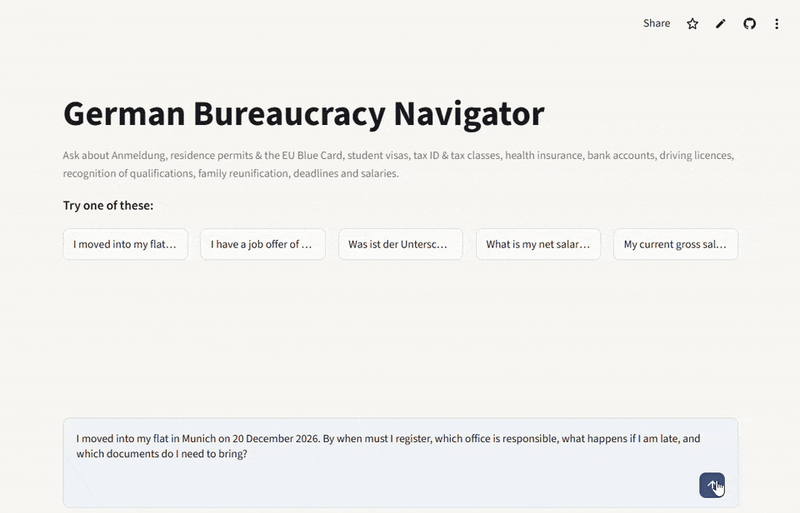
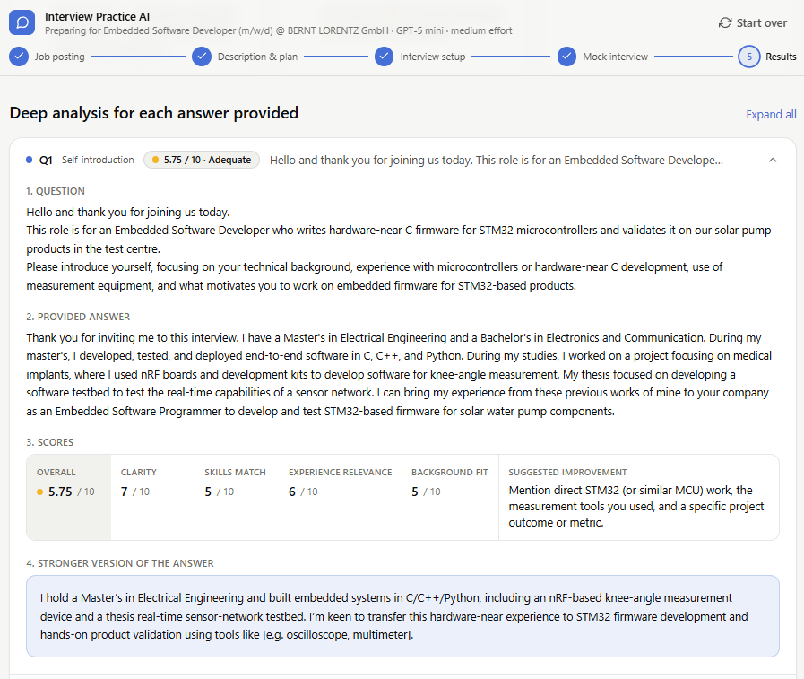

# Hi, I'm Aishwarya

**EN** · I build LLM applications and take them all the way to a deployed product: retrieval-augmented generation, tool-calling agents with LangChain and LangGraph, and full-stack web apps. I enforce guardrails in code rather than in prompts. I explain the reasoning behind each design choice and measure how my applications perform, with retrieval and faithfulness scores or cost per session. Open to junior AI roles in Germany · 

**DE** · Ich entwickle LLM-Anwendungen von der Idee bis zum Deployment: Retrieval-Augmented Generation (RAG), Agenten mit Tool-Calling auf Basis von LangChain und LangGraph sowie Full-Stack-Webanwendungen. Guardrails setze ich im Code um statt im Prompt. Jede Designentscheidung begründe ich nachvollziehbar, und die Leistung meiner Anwendungen messe ich, etwa mit Retrieval- und Faithfulness-Scores oder den Kosten pro Sitzung. Offen für Junior-Positionen im KI-Bereich in Deutschland.

**Stack:** Python · TypeScript · LangChain · LangGraph · RAG · RAGAS · Next.js · Streamlit · Docker · Git  
**Languages:** English (C2) · German (B2)

---

Below are two LLM applications I designed, built and deployed end to end. Both are live and tested, and each card follows the same structure: the problem it solves, a demo, a key metric, the main design decisions and the stack.

## German Bureaucracy Navigator

**The problem.** People who move to Germany face dozens of procedures, like registering an address, getting a residence permit, choosing a tax class or finding health insurance. The official explanations are scattered across many sites and mostly in German. The Navigator answers these questions in English or German, cites the official source behind every fact, and says so when it doesn't know.

**Demo.** [Live app on Streamlit Community Cloud](https://germanbureaucracynavigator-nv4spe5owjrbx5kkumhffp.streamlit.app/) (the first load after idle takes about a minute)

**Key metric: evaluation results.** Evaluated on a 23-question labelled set; a full evaluation run costs $0.25. Against a dense-only retrieval baseline, hybrid search plus reranking raised MRR from 0.85 to 0.97.

| Hit-rate@5 | MRR | Faithfulness | Tool selection | Not-covered handled |
|:---:|:---:|:---:|:---:|:---:|
| **100 %** | **0.97** | **0.95** | **21 / 23** | **3 / 3** |

**Design decisions.**

| Chose | Rejected | Why |
|---|---|---|
| Hybrid retrieval (BM25 + dense search) with a reranker | Dense search alone | Official German terms need exact keyword matching, everyday questions need semantic matching. Hybrid found every expected document; dense alone did not. |
| Retrieval as a tool the agent calls when it needs to | Searching the knowledge base before every answer | Not every question needs the knowledge base. Some are answered entirely by a dedicated tool, such as the Blue Card salary check, the deadline calculator or currency conversion. |
| Guardrails in code, plus a grounding check on every answer | Safety and citation rules in the prompt only | Code can't be talked around, and unsupported claims are removed before the user sees them. |

**Project stack.** Python · LangChain 1.x + LangGraph · OpenRouter · ChromaDB · Cohere Rerank · RAGAS · Streamlit · pytest
→ [Repository](https://github.com/aishwaryamuralikrishnan/German_Bureaucracy_Navigator)

## Interview Practice AI

**The problem.** Preparing for an interview usually means guessing which questions a specific job will bring. This app reads a real job posting in English or German and builds a study plan from it. It then runs a mock interview one question at a time, scores every answer and rewrites each one into a stronger version.

**Demo.** [Live app on Vercel](https://interview-practice-ai-app.vercel.app/)

**Key metric: cost per session.** A five-question mock interview costs about 3 cents on the default model. The user picks the model; each step up costs 5× more. Answer scoring has not been systematically evaluated yet; an LLM-as-a-judge evaluation is the planned next step.

| Model | A 5-question session | Best when |
|---|:---:|---|
| GPT-5 nano | ~$0.01 | Testing the app, or practising in bulk |
| **GPT-5 mini** (default) | **~$0.03** | Strong reasoning at low cost |
| GPT-5 | ~$0.14 | The interview that actually matters |

**Design decisions.**

| Chose | Rejected | Why |
|---|---|---|
| A fixed pipeline of five model calls, with no tools | An agent | Every session runs the same steps, so there is nothing for an agent to decide, and a model without tools is harder to misuse. |
| Next.js and TypeScript, with model calls on the server | Keeping the first Python/Streamlit version | The API key stays off the browser, and the interview runs as a real conversation. |
| JSON outputs, checked and bounded in code | Free-text responses | Every score and field is validated, so the report never breaks, whatever the model returns. |

**Project stack.** TypeScript · Next.js 16 · React 19 · Tailwind CSS · Recharts · OpenRouter (GPT-5 family) · Vitest · Playwright · Vercel
→ [Repository](https://github.com/aishwaryamuralikrishnan/Interview_Practice_AI_App)
